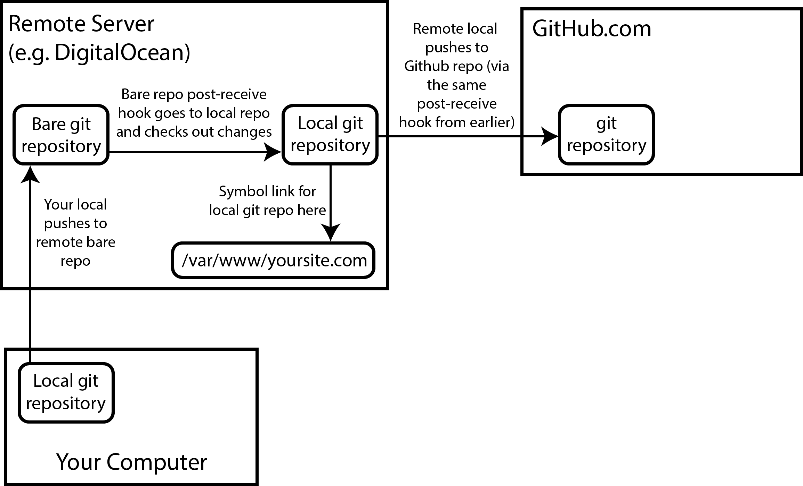

# Portfolio repo

## README.md will contain SSH keys, logging and various other information

## CICD setup:
* Created bare repo on VM with a post-hook to update the directory with index.html file
* Using bash script automated deployment on the website and on Github

## CI pipeline
 